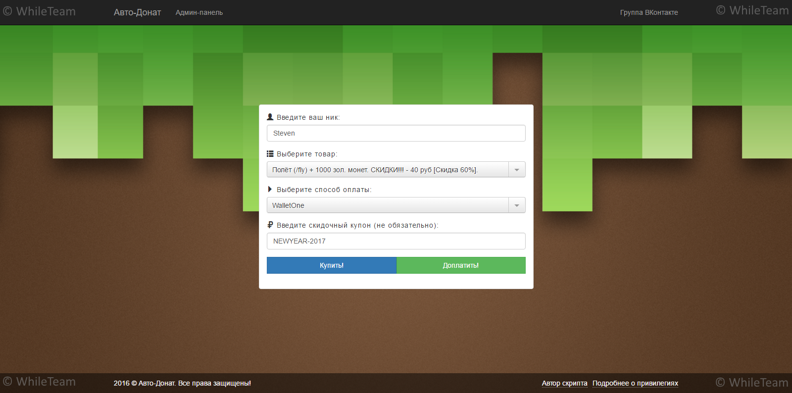
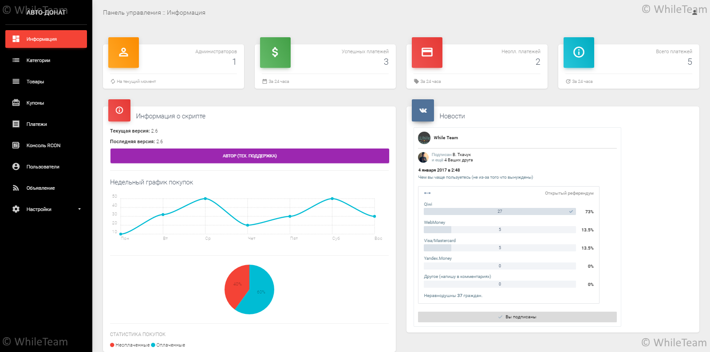

# Автодонат для Minecraft [v2.6]

### Ссылки:
1. [О скрипте автодоната](#about)
2. [Установка скрипта](#install)
3. [Файл cron.php](#cron)
4. [Подключение платёжной системы](#merchants)
    * [InterKassa](#interkassa)
    * [UnitPay](#unitpay)
    * [FreeKassa](#freekassa)
    * [MyKassa](#mykassa)
    * [WalletOne](#walletone)
    * [RoboKassa](#robokassa)
    * [WebMoney](#webmoney)
5. [Купить](#wherebuy)

##  О скрипте
Актуальная информация о скрипте размещена [здесь](http://whileteam.ru/?page=products&do=view&id=1).

##  Установка скрипта
Установка скрипта происходит в автоматическом режиме. Вам не недо саому импортировать SQL файл.
Что-же нужно для установки скрипта:
1. Версия PHP >= 5.6
2. Выдать права 777 на файл config.php
3. Перейти по адресу: http://ваш_сайт/install.php
4. Ввести первоначально требуемые данные и нажать установить
5. После установки <u>необъходимо</u> удалить файл install.php и install.sql из директории скрипта.

Всё, скрипт установен!
Админ-панель размещена по адресу: /cpanel.php.

(Стандартные данные для входа: admin:admin)

##  О файле cron.php
Начиная с версии 2.0 файл cron.php стал очень важным и желательно что-бы его каждый подключил к CRON.

Его работа заключается в том что-бы удалять старые не оплаченные платежи в БД (тем самым отчищая БД) и выполняет выдачу товаров которые не удалось выдать при покупке.

Рекомендуеться поставить его выполняться каждые 5 минут.

##  Платёжные системы
На данный момент в версии 2.6 доступны следующие платёжные системы:
* [InterKassa](#interkassa)
* [UnitPay](#unitpay)
* [FreeKassa](#freekassa)
* [MyKassa](#mykassa)
* [WalletOne](#walletone)
* [RoboKassa](#robokassa)
* [WebMoney](#webmoney)

###  Подключение InterKassa
    URL возврата в случае успеха: http://ваш_сайт.ру/?pstatus=success [POST]
    URL возврата в случае неудачи: http://ваш_сайт.ру/?pstatus=fail [POST]
    URL оповещения: http://ваш_сайт.ру/payments/interkassa.php [POST]
    Алгоритм подписи: MD5

    В админ-панеле скрипта введите ID и секретные слова магазина, так-же поставьте галочку "Включить InterKassa?"! Для совершения тестовых платежей, включите их в админ-панеле.
    
###  Подключение UnitPay
    URL возврата в случае успеха: http://ваш_сайт.ру/?pstatus=success [POST]
    URL возврата в случае неудачи: http://ваш_сайт.ру/?pstatus=fail [POST]
    URL оповещения: http://ваш_сайт.ру/payments/unitpay.php [POST]
    
    В админ-панеле скрипта введите ID и секретные слова магазина, так-же поставьте галочку "Включить Unitpay?"!
    
###  Подключение FreeKassa
    URL возврата в случае успеха: http://ваш_сайт.ру/?pstatus=success [POST]
    URL возврата в случае неудачи: http://ваш_сайт.ру/?pstatus=fail [POST]
    URL оповещения: http://ваш_сайт.ру/payments/freekassa.php [POST]
    
    В админ-панеле скрипта введите ID и секретные слова магазина, так-же поставьте галочку "Включить FreeKassa?"!

###  Подключение MyKassa
    URL возврата в случае успеха: http://ваш_сайт.ру/?pstatus=success [POST]
    URL возврата в случае неудачи: http://ваш_сайт.ру/?pstatus=fail [POST]
    URL оповещения: http://ваш_сайт.ру/payments/mykassa.php [POST]
    
    В админ-панеле скрипта введите ID и секретные слова магазина, так-же поставьте галочку "Включить MyKassa?"!

###  Подключение WalletOne
    URL возврата в случае успеха: http://ваш_сайт.ру/?pstatus=success [POST]
    URL возврата в случае неудачи: http://ваш_сайт.ру/?pstatus=fail [POST]
    URL скрипта: http://ваш_сайт.ру/payments/walletone.php [POST]
    Метод формирования ЭЦП - MD5
    
    В админ-панеле скрипта введите ID и ключ магазина, так-же поставьте галочку "Включить WalletOne?"!

###  Подключение RoboKassa
    URL возврата в случае успеха: http://ваш_сайт.ру/?pstatus=success [POST]
    URL возврата в случае неудачи: http://ваш_сайт.ру/?pstatus=fail [POST]
    URL оповещения: http://ваш_сайт.ру/payments/robokassa.php [POST]
    
    В админ-панеле скрипта введите ID и секретные слова магазина, так-же поставьте галочку "Включить RoboKassa?"!

###  Подключение WebMoney Merchant
    Success URL: http://ваш_сайт.ру/?pstatus=success [LINK]
    Fail URL: http://ваш_сайт.ру/?pstatus=fail [LINK]
    Result URL: http://ваш_сайт.ру/payments/webmoney.php
    
    Метод формирования контрольной подписи: SHA256!
    
    Заполните SecretKey (не путать с Secret Key X20!), можно ввести тюда что хотите, я обычно захожу на сайт генератора паролей и генерирую секретный ключ там.
    В админ-панеле скрипта введите кошелёк и секретный ключ, так-же поставьте галочку "Включить WebMoney?"!

##  Где купить это добро?)
### »[ТУТ](http://whileteam.ru/?page=products&do=view&id=1)

##  Лог изенений:
Coming soon....

&copy; WhileTeam